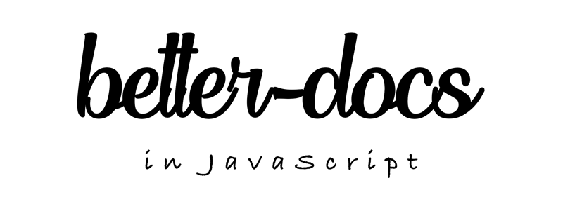
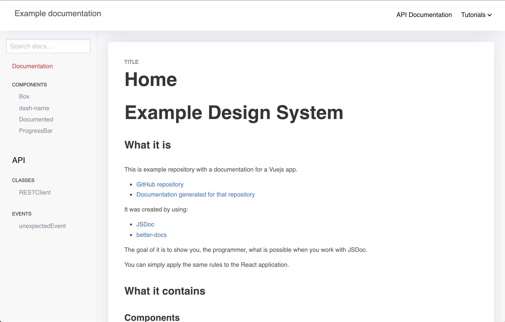
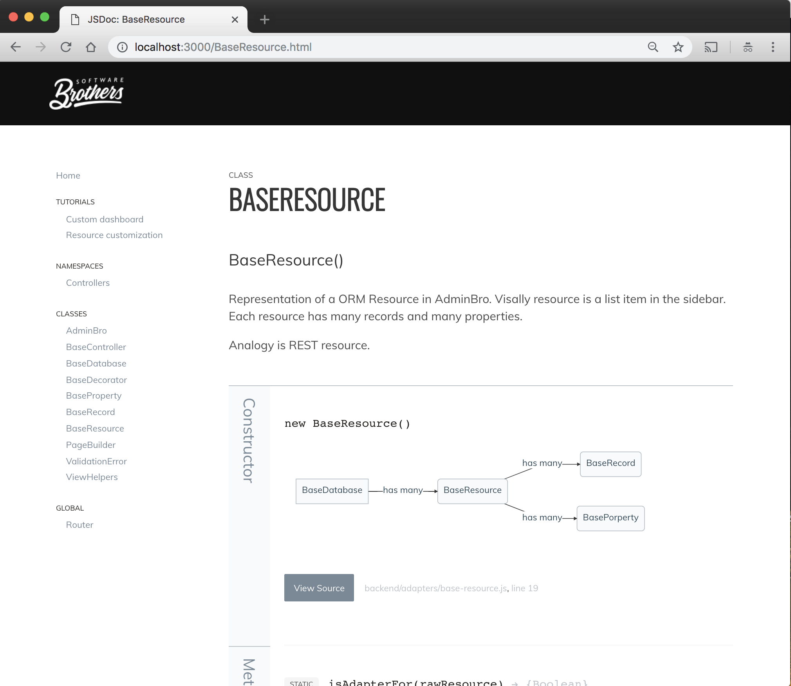
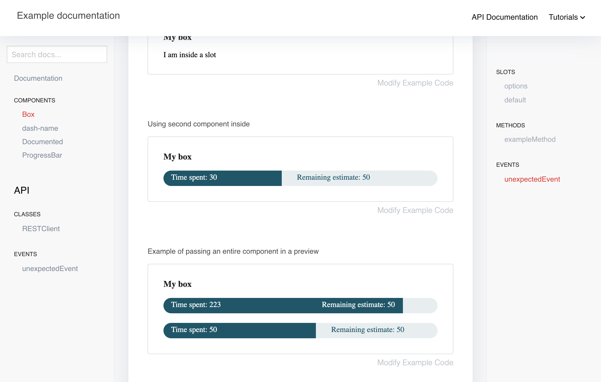

Documentation toolbox for your **javascript** / **typescript** projects based on JSDoc3 with **@category**, **@component** and **@optional** plugins.

This is how it looks:

<table>
  <tr>
    <td>
      <a href='./readme/class.png'></a>
    </td>
    <td>
      <a href='./readme/with-mermaid.png'></a>
    </td>
    <td>
      <a href='./readme/component.png'></a>
    </td>
  </tr>
</table>

# Example

Example documentation can be found here: https://softwarebrothers.github.io/example-design-system/index.html

# OpenSource SoftwareBrothers community

- [Join the community](https://join.slack.com/t/adminbro/shared_invite/zt-czfb79t1-0U7pn_KCqd5Ts~lbJK0_RA) to get help and be inspired.
- subscribe to our [newsletter](http://opensource.softwarebrothers.co)

# Installation

```sh
npm install --save-dev better-docs
```

# Theme Usage

## With command line

Assuming that you have [jsdoc](https://github.com/jsdoc/jsdoc) installed globally:

```
jsdoc your-documented-file.js -t ./node_modules/better-docs
```

## With npm and configuration file

In your projects package.json file - add a new script:

```
"script": {
  "docs": "jsdoc -c jsdoc.json"
}
```

in your `jsdoc.json` file, set the template:

```json
"opts": {
  "template": "node_modules/better-docs"
}
```

# TypeScript support

better-docs has a plugin which allows you to generate documentation from your TypeScript codebase.

## Usage

To use it update your `jsdoc.json` file

```
...
"tags": {
    "allowUnknownTags": ["optional"] //or true
},
"plugins": [
    "node_modules/better-docs/typescript"
],
"source": {
    "includePattern": "\\.(jsx|js|ts|tsx)$",
},
...
```

And now you can run your `jsdoc` command and parse TypeScript files.

## How it works?

It performs 4 operations:

* First of all it transpiles all .ts and .tsx files to .js, so that all comments used by you are treated
as a regular JSDoc comments.

Furthermore it:

* Converts all your commented `type` aliases to `@typedef`
* Converts all your commented `interface` definitions to `@interface`,
* Converts descriptions for your public, protected, static class members

so they can be printed by JSDoc automatically.

## Examples

```
/**
 * ActionRequest
 * @memberof Action
 * @alias ActionRequest
 */
export type ActionRequest = {
  /**
   * parameters passed in an URL
   */
  params: {
    /**
     * Id of current resource
     */
    resourceId: string;
    /**
     * Id of current record
     */
    recordId?: string;
    /**
     * Name of an action
     */
    action: string;

    [key: string]: any;
  };
}
```

is converted to:

```
/**
 * ActionRequest'
 * @memberof Action'
 * @alias ActionRequest'
 * @typedef {object} ActionRequest'
 * @property {object} params   parameters passed in an URL'
 * @property {string} params.resourceId   Id of current resource'
 * @property {string} [params.recordId]   Id of current record'
 * @property {string} params.action   Name of an action'
 * @property {any} params.{...}'
 */
```

Also you can comment the interface in a similar fashion:

```
/**
 * JSON representation of an {@link Action}
 * @see Action
 */
export default interface ActionJSON {
  /**
   * Unique action name
   */
  name: string;
  /**
   * Type of an action
   */
  actionType: 'record' | 'resource' | Array<'record' | 'resource'>;
  /**
   * Action icon
   */
  icon?: string;
  /**
   * Action label - visible on the frontend
   */
  label: string;
  /**
   * Guarding message
   */
  guard?: string;
  /**
   * If action should have a filter (for resource actions)
   */
  showFilter: boolean;
  /**
   * Action component. When set to false action will be invoked immediately after clicking it,
   * to put in another words: there wont be an action view
   */
  component?: string | false | null;
}
```

or describe your class properties like that:

```
/**
 * Class name
 */
class ClassName {
  /**
   * Some private member which WONT be in jsdoc (because it is private)
   */
  private name: string

  /**
   * Some protected member which will go to the docs
   */
  protected somethingIsA: number

  /**
   * And static member which will goes to the docs.
   */
  static someStaticMember: number

  public notCommentedWontBeInJSDoc: string

  constructor(color: string) {}
}
```

# @category plugin

better-docs also allows you to nest your documentation into categories and subcategories in the sidebar menu.

## Usage

To add a plugin - update `plugins` section in your `jsdoc.json` file:

```
...
"tags": {
    "allowUnknownTags": ["category"] //or true
},
"plugins": [
    "node_modules/better-docs/category"
],
...
```

and then you can use `@category` and/or `@subcategory` tag in your code:

```
/**
 * Class description
 * @category Category
 * @subcategory All
 */
class YourClass {
  ....
}
```

# @component plugin [BETA]

Better-docs also allows you to document your [React](https://reactjs.org/) and [Vue](https://vuejs.org/) components automatically. The only thing you have to do is to add a `@component` tag. It will take all props from your components and along with an `@example` tag - will generate a __live preview__.

## Installation instructions

Similar as before to add a plugin - you have to update the `plugins` section in your `jsdoc.json` file:

```
...
"tags": {
    "allowUnknownTags": ["component"] //or true
},
"plugins": [
    "node_modules/better-docs/component"
],
...
```

Since __component__ plugin uses [parcel](https://parceljs.org) as a bundler you have to install it globally. To do this run:

```
# if you use npm
npm install -g parcel-bundler

# or yarn
yarn global add parcel-bundler
```

## Usage

To document components simply add `@component` in your JSDoc documentation:

```jsx
/**
 * Some documented component
 *
 * @component
 */
const Documented = (props) => {
  const { text } = props
  return (
    <div>{text}</div>
  )
}

Documented.propTypes = {
  /**
   * Text is a text
   */
  text: PropTypes.string.isRequired,
}

export default Documented
```

The plugin will take the information from your [PropTypes](https://reactjs.org/docs/typechecking-with-proptypes.html) and put them into an array.

For Vue it looks similar:

```vue
<script>
/**
 * @component
 */
export default {
  name: 'ExampleComponent',
  props: {
    spent: {
      type: Number,
      default: 30,
    },
    remaining: {
      type: Number,
      default: 40,
    }
  },
}
</script>
```

In this case, props will be taken from `props` property.

## Preview

`@component` plugin also modifies the behaviour of `@example` tag in a way that it can generate an actual __component preview__. What you have to do is to add an `@example` tag and return component from it:

**React example:**

```jsx
/**
 * Some documented component
 *
 * @component
 * @example
 * const text = 'some example text'
 * return (
 *   <Documented text={text} />
 * )
 */
const Documented = (props) => {
  ///...
}
```

**Vue example 1:**

```vue
<script>
/**
 * @component
 * @example
 * <ExampleComponent :spent="100" :remaining="50"></ExampleComponent>
 */
export default {
  name: 'ExampleComponent',
  //...
}
</script>
```

**Vue example 2:**

```vue
<script>
/**
 * @component
 * @example
 * {
 *   template: `<Box>
 *     <ProgressBar :spent="spent" :remaining="50"></ProgressBar>
 *     <ProgressBar :spent="50" :remaining="50" style="margin-top: 20px"></ProgressBar>
 *   </Box>`,
 *   data: function() {
 *     return {spent: 223};
 *   }
 * }
 */
export default {
  name: 'ExampleComponent',
  //...
}
</script>
```

You can put as many `@example` tags as you like in one component and "caption" each of them like this:

```javascript
/**
 * @component
 * @example <caption>Example usage of method1.</caption>
 * // your example here
 */
```

## Mixing components in preview

Also you can use multiple components which are documented with `@component` tag together. So lets say you have 2 components and in the second component you want to use the first one as a wrapper like this:

```javascript
// component-1.js
/**
 * Component 1
 * @component
 *
 */
const Component1 = (props) => {...}

// component-2.js
/**
 * Component 2
 * @component
 * @example
 * return (
 *   <Component1>
 *     <Component2 prop1={'some value'}/>
 *     <Component2 prop1={'some other value'}/>
 *   </Component1>
 * )
 */
const Component2 = (props) => {...}
```

## Wrapper component [only React]

Most probably your components will have to be run within a particular context, like within redux store provider or with custom CSS libraries.
You can simulate this by passing a `component.wrapper` in your `jsdoc.json`:
_(To read more about passing options - scroll down to __Customization__ section)_

```json
// jsdoc.json
{
    "opts": {...},
    "templates": {
        "better-docs": {
            "name": "AdminBro Documentation",
            "component": {
              "wrapper": "./path/to/your/wrapper-component.js",
            },
            "...": "...",
        }
    }
}
```

Wrapper component can look like this:

```javascript
// wrapper-component.js
import React from 'react'
import { BrowserRouter } from 'react-router-dom'
import { createStore } from 'redux'
import { Provider } from 'react-redux'

const store = createStore(() => ({}), {})

const Component = (props) => {
  return (
    <React.Fragment>
      <head>
        <link type="text/css" rel="stylesheet" href="https://cdnjs.cloudflare.com/ajax/libs/bulma/0.7.5/css/bulma.css" />
      </head>
      <Provider store={store}>
        <BrowserRouter>
          {props.children}
        </BrowserRouter>
      </Provider>
    </React.Fragment>
  )
}

export default Component
```

## Styling React examples

Better-docs inserts all examples within an `iframe`. This results in the following styling options:

1. If you pass styles inline - they will work right away.

2. For `css modules` to work with `parcel` bundler - you have to install `postcss-modules` package:

```
yarn add postcss-modules
```

and create a `.postcssrc` file:


```json
// .postcssrc
{
	"modules": true
}
```

3. For [styled-components](https://www.styled-components.com/) you have to use wrapper component which looks like this:

```jsx
import React from 'react'
import { StyleSheetManager } from 'styled-components'

const Component = (props) => {
  const { frameContext } = props
  return (
    <StyleSheetManager target={frameContext.document.head}>
      {props.children}
    </StyleSheetManager>
  )
}

export default Component
```

## Adding commands to bundle entry file

`@component` plugin creates an entry file: `.entry.js` in your _docs_ output folder. Sometimes you might want to add something to it. You can do this by passing: `component.entry` option, which is an array of strings.

So let's say you want to add `babel-polyfill` and 'bulma.css' framework to your bundle. You can do it like this:

```json
// jsdoc.json
{
    "opts": {...},
    "templates": {
        "better-docs": {
            "name": "AdminBro Documentation",
            "component": {
                "entry": [
                    "import 'babel-polyfill';",
                    "import 'bulma/css/bulma.css';"
                ]
            },
            "...": "...",
        }
    }
}
```

# Customization

First of all, let me state that better-docs extends the `default` template. That is why default template parameters are also handled.

[BETA]: You must explicitly set the `search` option of the `default` template to `true` to enable search

To customize the better-docs pass `options` to `templates['better-docs']`. section in your `jsdoc configuration file`.

Example configuration file with settings for both `default` and `better-docs` templates:

```json
{
    "tags": {
        "allowUnknownTags": ["category"]
    },
    "source": {
        "include": ["./src"],
        "includePattern": ".js$",
        "excludePattern": "(node_modules/|docs)"
    },
    "plugins": [
        "plugins/markdown",
        "jsdoc-mermaid",
        "node_modules/better-docs/category"
    ],
    "opts": {
        "encoding": "utf8",
        "destination": "docs/",
        "readme": "readme.md",
        "recurse": true,
        "verbose": true,
        "tutorials": "./docs-src/tutorials",
        "template": "better-docs"
    },
    "templates": {
        "cleverLinks": false,
        "monospaceLinks": false,
        "search": true,
        "default": {
            "staticFiles": {
              "include": [
                  "./docs-src/statics"
              ]
            }
        },
        "better-docs": {
            "name": "AdminBro Documentation",
            "logo": "images/logo.png",
            "title": "", // HTML title
            "css": "style.css",
            "trackingCode": "tracking-code-which-will-go-to-the-HEAD",
	    "hideGenerator": false,
            "navLinks": [
                {
                    "label": "Github",
                    "href": "https://github.com/SoftwareBrothers/admin-bro"
                },
                {
                    "label": "Example Application",
                    "href": "https://admin-bro-example-app.herokuapp.com/admin"
                }
            ]
        }
    }
}
```

## Extras

### typedef(import(...))

better-docs also has one extra plugin for handling typescript'like types imports like (it has to be one-liner):

```
/** @typedef {import('./some-other-file').ExportedType} ExportedType */
```

It simply removes that from the code so JSDoc wont throw an error. In order to use it add this plugin to your plugins section:

```
  "plugins": [
        "node_modules/better-docs/typedef-import"
    ],
```

# Setting up for the development

If you want to change the theme locally follow the steps:

1. Clone the repo to the folder where you have the project:

```
cd your-project
git clone git@github.com:SoftwareBrothers/better-docs.git
```

or add it as a git submodule:

```
git submodule add git@github.com:SoftwareBrothers/better-docs.git
```

2. Install the packages

```
cd better-docs

npm install

# or

yarn
```

3. Within the better-docs folder run the gulp script. It will regenerate documentation every time you change something.

It supports following EVN variables:

* `DOCS_COMMAND` - a command in your root repo which you use to generate documentation: i.e. `DOCS_COMMAND='jsdoc -c jsdoc.json'` or `npm run docs` if you have `docs` command defined in `package.json` file
* `DOCS_OUTPUT` - where your documentation is generated. It should point to the same folder your jsdoc `--destination` conf. But make sure that it is relative to the path where you cloned `better-docs`.
* `DOCS` - list of folders from your original repo what you want to watch for changes. Separated by comma.

```
cd better-docs
DOCS_COMMAND='npm run docs' DOCS=../src/**/*,../config/**/* DOCS_OUTPUT=../docs cd better-docs && gulp
```

The script should launch the browser and refresh it whenever you change something in the template or in `DOCS`.

# Setting up the jsdoc in your project

If you want to see how to setup jsdoc in your project - take a look at these brief tutorials:

- JSDoc - https://www.youtube.com/watch?v=Yl6WARA3IhQ
- better-docs and Mermaid: https://www.youtube.com/watch?v=UBMYogTzsBk

# License

better-docs is Copyright © 2019 SoftwareBrothers.co. It is free software and may be redistributed under the terms specified in the [LICENSE](LICENSE) file - MIT.

# About SoftwareBrothers.co


We're an open, friendly team that helps clients from all over the world to transform their businesses and create astonishing products.

* We are available for [hire](https://softwarebrothers.co/contact).
* If you want to work for us - check out the [career page](https://softwarebrothers.co/career).
